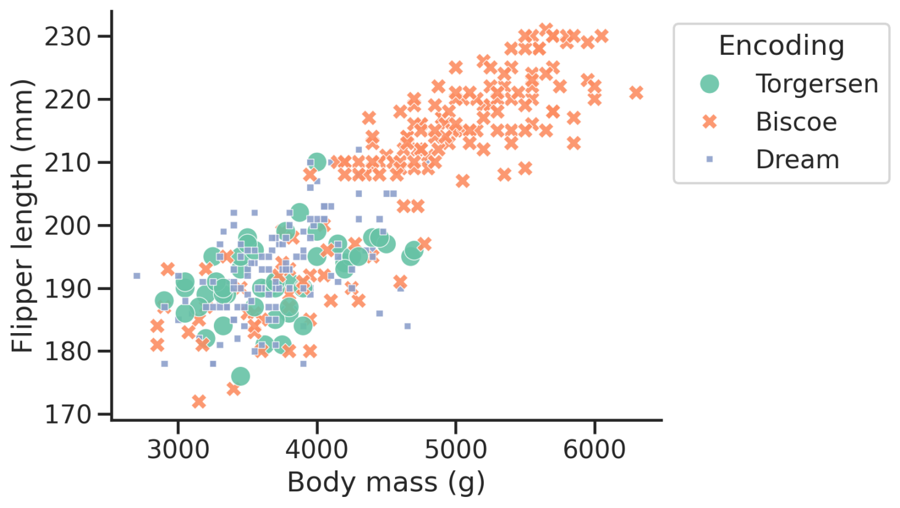
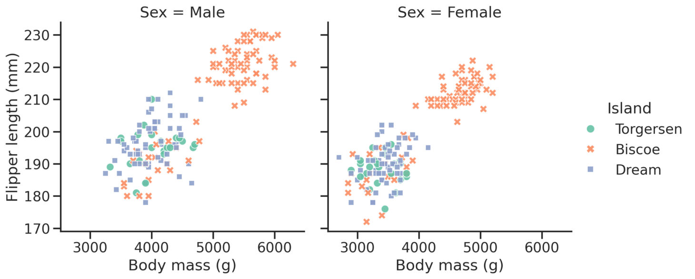

We've looked at the data points in your plot. Now lets look at the box around those points: everything besides the data!

Caption: An empty Figure and axes object with no points plotted.

## Axes labels

Ensure your figure axes are labelled and include units if relevant (almost always will be!)

## Axes scale

Choose a sensible scale for your dataset. This can include using a log scale, or changing the limits (maximum and minimum values) of the axes.

## Placing the legend

In some of the examples with randomly generated data, you'll see that the Python library being used attempts to find the best location for the legend, where it overlaps the least number of points. It is a good idea to move the legend outside of the plot area and to one side in these situations.

## Multiple panels

It can be helpful to split your plots into multiple panels to make it easier for your readers to absorb complex data.

Align the axes you want to compare: stack plots vertically if you want to ocmpare the x axes; place them side by side if you want to focus on the y axes.

